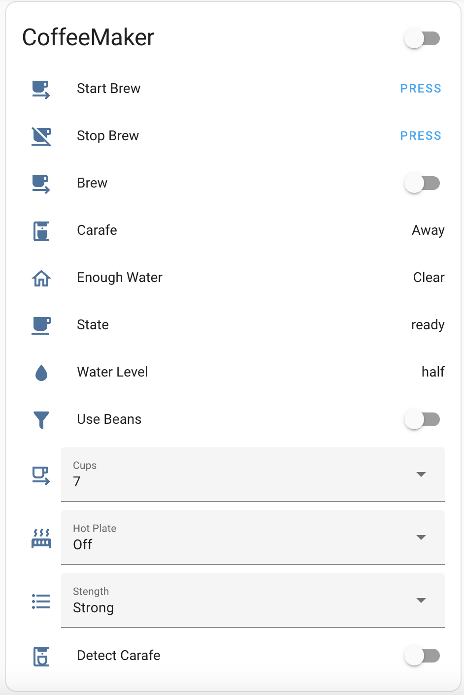

# SmarterCoffee
SmarterCoffee Maker v. 1.0 HA Integration

This is Home Assistant instegration for SmarterCoffee Maker v.1.0

SmarterCoffee Machine v 2.0 is NOT supported and will NOT be supported.

**CoffeeMaker**

**Brew Coffee Service**

# Installation

- HACS - preffered. 
  - Make sure you have [HACS](https://hacs.xyz) installed
  - Go to HACS/Integrations
  - Click Explore & Add Repositories
  - Type smarter and select SmarterCoffee Maker repository
  - Click Install this repository in HACS
  
  

- Manual - copy contents of custom_components into yours config/custom_components and restart HA

# Supported Features
- auto discovery for HA Config Flow
- trigger start/stop brew
- status: ready, brewing etc
- select amount of cups (from 1 to 12)
- select brew mode - using beans (grinding) or filter style
- select strenght of brew (from weak to strong)
- select hot plate minutes (from 5 to 40 minutes)
- detect water level
- detect water presence
- detect carafe presence

# Setup
In your HA UI, go to Configuration/Integrations, select 'Add Integration', search for 'SmarterCoffee Maker' and follow to instructions.
